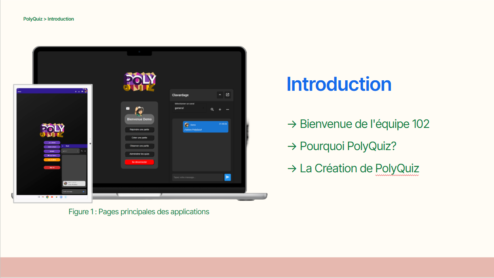

# 🎯 PolyQuiz
**Interactive Learning Through Real-Time Multiplayer Quizzes**

PolyQuiz is a comprehensive full-stack application designed to enhance learning through interactive quizzes. With real-time multiplayer functionality and dynamic leaderboards, PolyQuiz creates an engaging educational environment that makes learning fun and competitive.



## 🚀 Features
✅ **Real-Time Multiplayer** – Compete with other students in live quiz sessions  
✅ **Dynamic Leaderboards** – Track progress and rankings across different topics  
✅ **Cross-Platform Support** – Access quizzes from web and mobile devices  
✅ **Comprehensive Analytics** – Monitor performance with detailed statistics  
✅ **Custom Quiz Creation** – Create and share your own quiz content

## 🛠 Tech Stack
* **Electron** – Cross-platform desktop application framework
* **Angular** – Frontend web framework
* **Flutter** – Mobile application development
* **Firebase** – Authentication and real-time features
* **MongoDB** – Database management

## 📲 Installation

### Desktop Client (Electron)
1. Clone the repository:
```bash
git clone https://github.com/mehdiougadi/PolyQuiz.git
```

2. Navigate to the project folder:
```bash
cd mobile_client
```

3. Install dependencies:
```bash
npm install
```

4. Start the development server:
```bash
npm start
```

### Mobile Client (Electron)
1. Clone the repository:
```bash
git clone https://github.com/mehdiougadi/PolyQuiz.git
```

2. Navigate to the project folder:
```bash
cd mobile_client
```

3. Install dependencies:
```bash
flutter pub get
```

4. Start the development server:
```bash
flutter run
```

## 📩 Contact
For inquiries, suggestions, or collaboration, feel free to reach out to us at Mehdiougadiofficial@gmail.com.
